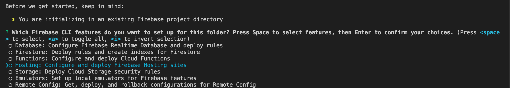
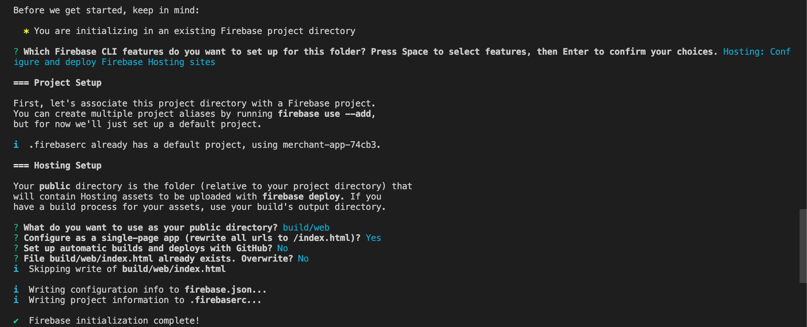

# Kreditplus Deasy Mobile

Deasy Flutter application.

## How to install

Clone this repository, open the terminal and run this code :

```
flutter pub get
```

## How to run the application
There are 3 main configuration on the flutter app, develop, staging and production.

To run the app, we must run the app through the terminal to pass in a main file name when launching the app, because the default ```main.dart``` is changed, so we never accidentally launch the non configured app.

### #Android

```
// RUN
flutter run --[debug|release] --flavor [dev|prod|staging|mock] -t lib/flavor/[dev|prod|staging|mock]/main_[dev|prod|staging|mock].dart
// EXAMPLE
flutter run --debug --flavor dev -t lib/flavor/dev/main_dev.dart
```

```
// BUILD APK
flutter build apk --[debug|release] --flavor [dev|prod|staging|mock] -t lib/flavor/[dev|prod|staging|mock]/main_[dev|prod|staging|mock].dart
```

```
// BUILD APK WITH SPLIT-PER-ABI
flutter build apk --split-per-abi --[debug|release] --flavor [dev|prod|staging|mock] -t lib/flavor/[dev|prod|staging|mock]/main_[dev|prod|staging|mock].dart
```

```
// BUILD AAB
flutter build appbundle --split-per-abi --flavor [dev|prod|staging|mock] -t lib/flavor/[dev|prod|staging|mock]/main_[dev|prod|staging|mock].dart
```

### #iOS

develop
```
//RUN
flutter run --flavor develop -t lib/flavor/dev/main_dev.dart
```

develop
```
//RUN
flutter run --flavor staging -t lib/flavor/staging/main_staging.dart
```

production :
```
flutter run --flavor production -t lib/flavor/prod/main_prod.dart
```

```
// BUILD IPA
flutter build ios --flavor [develop|production|staging|mock] -t lib/flavor/[develop|prod|staging|mock]/main_[develop|prod|staging|mock].dart
```


### #Web
develop

Run in Chrome using the default renderer option (auto):
```
flutter run -d chrome --flavor dev -t lib/flavor/dev/main_dev.dart 
```
flutter run -d chrome --release --flavor dev -t lib/flavor/dev/main_dev.dart
```
Build your app in release mode, using the default (auto) option:
```
flutter build web -t lib/flavor/dev/main_dev.dart
```

Build your app in release mode, using just the CanvasKit or html renderer:
```
flutter build web --web-renderer [canvaskit|html] -t lib/flavor/dev/main_dev.dart
```


production :

Run in Chrome using the default renderer option (auto):
```
flutter run -d chrome --release --flavor prod -t lib/flavor/prod/main_prod.dart
```
Build your app in release mode, using the default (auto) option:
```
flutter build web --release -t lib/flavor/prod/main_prod.dart
```

Build your app in release mode, using just the CanvasKit or html renderer:
```
flutter build web --web-renderer [canvaskit|html] --release -t lib/flavor/prod/main_prod.dart
```


staging :

Run in Chrome using the default renderer option (auto):
```
flutter run -d chrome --release --flavor staging -t lib/flavor/staging/main_staging.dart
```
Build your app in release mode, using the default (auto) option:
```
flutter build web --release -t lib/flavor/staging/main_staging.dart
```

Build your app in release mode, using just the CanvasKit or html renderer:
```
flutter build web --web-renderer [canvaskit|html] --release -t lib/flavor/staging/main_staging.dart
```


see detail about [web renderer](https://docs.flutter.dev/development/tools/web-renderers) 

# Kreditplus Deasy Web Hosting

Deasy Flutter web hosting.

## How to build web

Build using makefile, open the terminal and run this code :

```
make build-web
```

## How to deploy web to firebase hosting

Before deploy to firebase hosting please init your firebase config, open the terminal and run this code :

```
firebase init
```

then, select hosting using space button.



then, type "public" as default public directory

then, type "y" to configure as single page app

then, type "n" to disable auto deploy with Github

then, type "n" to disable overwrite index.html / existing index html file



Deploy using makefile, open the terminal and run this code :

```
make deploy-web
```

## See Documentation

[Firebase Hosting Guide](https://firebase.google.com/docs/hosting)

[Firebase Hosting Quickstart](https://firebase.google.com/docs/hosting/quickstart)
```

### #How to run test

### install lcov in ubuntu
```
sudo apt-get update -qq -y
sudo apt-get install lcov -y
```

### install lcov in mac
```
brew install lcov
```

### Run tests, generate coverage files and convert to HTML

```
flutter test --coverage
genhtml coverage/lcov.info -o coverage/html
```

### Run Autobuild Android Dev
- checkout into apk-develop
- merge related branch (preferable-develop)
- push to origin
- check the build on `https://github.com/KB-FMF/deasy/actions`
